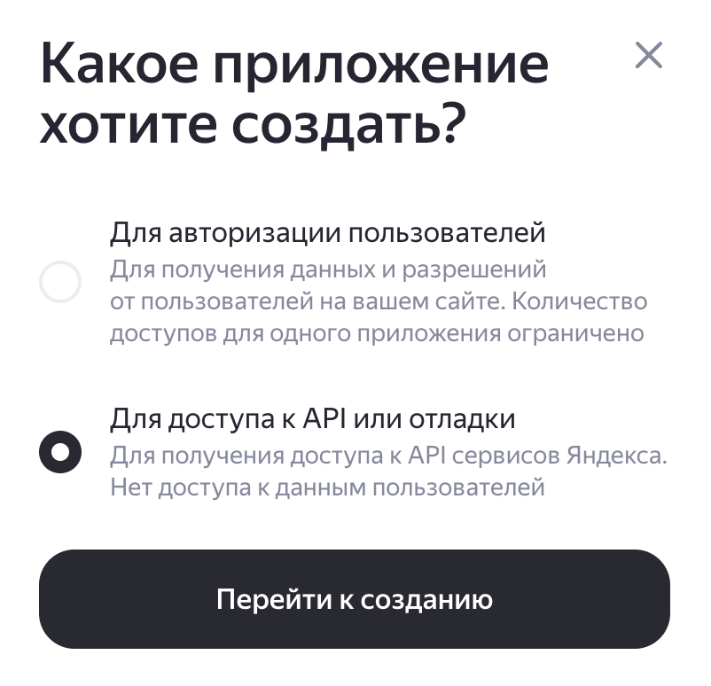
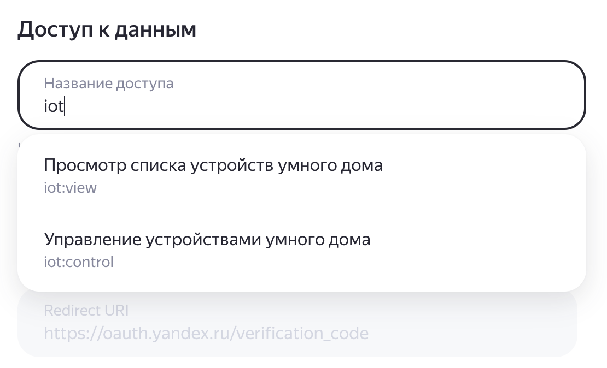

# Yandex Climate Modules (IoT API)

## Получение OAuth токена (Yandex IoT API)

1. Создайте приложение в Yandex OAuth и выберите тип **«Для доступа к API или отладки»**:

2. В правах доступа начните вводить `iot` и добавьте минимум:
- `iot:view` — просмотр списка устройств умного дома (достаточно для этой интеграции)

Опционально:
- `iot:control` — если вы планируете управлять устройствами (в этой интеграции сейчас не требуется)

3. Получите токен и вставьте его в настройках интеграции Home Assistant.

Custom integration for Home Assistant that exposes Yandex Station climate module sensors
(CO2 / temperature / humidity) via Yandex IoT API.

## Install (HACS custom repo)
- HACS → Integrations → ⋮ → Custom repositories
- Add this repo as **Integration**
- Install, restart Home Assistant

## Setup
- Settings → Devices & services → Add integration → "Yandex Climate Modules (IoT API)"
- Paste OAuth token with `iot.view` scope
- Select modules found automatically

Discovery uses `GET https://api.iot.yandex.net/v1.0/user/info` and then reads each device via `/v1.0/devices/{device_id}`.
